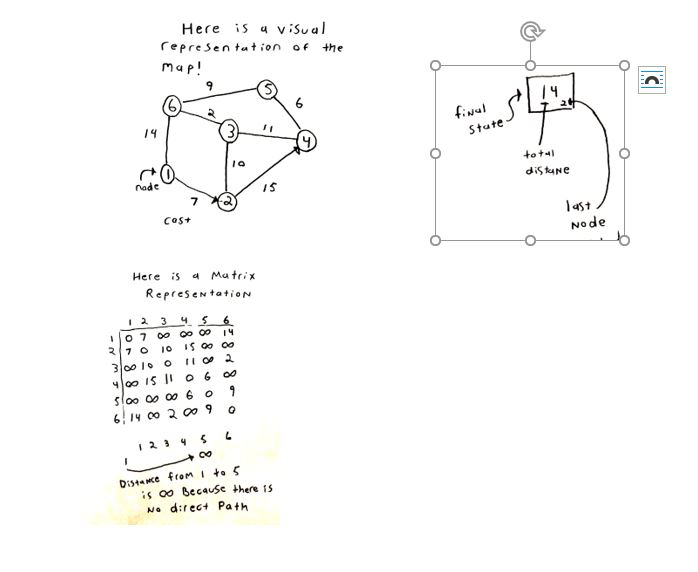

# Learning Basic Algorithms through C

## Arrays
Array.c is a program that allows a user to build an array choosing the size and individual numbers through the terminal. Then allows them to pick a series of options. Including printing forward and backwards recursively, sorting, searching as well as finding maximum and minimums.

## linear Search

Linear.c searches an array linearly, for a user's number. Returns a message stating whether or not the number exists in the array.

## Binary Search

Binary.c searches an array for a number by first sorting the array. Then asking if the middle index is equal, larger or smaller than the number being searched for. If the numbers are equal we return found, if not we chop off the left or right side of the array and repeat the process on the new middle. This is faster than linear search, with a cost of O(log(n)).

## Ternary Search

Ternary.c asks a user pick a number betweens two bounds of their choosing. Then asks for those bounds. Using the bounds it will tell how many guesses it will need to guess your number.
It divides the range of numbers into 3 parts. It guesses both the index marking the first upper bound of the first third and that of the second third. If neither of these are it then it asks if your number was smaller than both numbers larger than both numbers or inbetween. Asking these questions narrows the search parameters by two thirds each guess. Guaranteeing that the number will be guessed in log base 3 of the range it has to guess from. Ternary search is O(log3(n))

## Linked List

Linklist.c is a double linked list data structure that the user can insert, delete, and search. Using pointers to link allocated memory, and store values. Link list has an advantage over the Array due to it not having a predetermined amount of space but has an insert, delete and search time of O(n) even if we know the index of a value.

## Binary Search Tree

Bst.c is a linked list tree structure that  the user can use to insert, delete, and search values. It inserts values by comparing the value being inserted to the root node, then recursively moving left for less than root and right for more than root until the root has no children at which point the value is stored based on being less than or greater than its parent. Using this data structure allows for O(log(n)) insert, delete and search times.

## Hashing

Hashing has an insert, delete and search time of O(c) or constant time. The effectiveness of the hash data structure relies on the effectiveness of the key. The hash structure in this case is an array holding pointers to heads of the link list. Hashing works by evaluating some value and using its properties to assign it an index value corresponding to an array. In this case we are looking at the first letter of the string and assigning a value based on its index in the alphabet. So the string ‘apple’ ends up in index 0 and so on. If two values occupy the same index they are linked together by order of insertion time of insertion. The efficiency is based on the key. In this case a lot of words start with A and not a lot start with Z so the link list of Z will be short but the link list of A could be very long. An effective key method will evenly distribute the data as much as possible.

## Bubble Sort

Bubble.c sorts an array using bubble sort. Bubble sort runs in O(n^2). This works by running through a n size array, n times. At each element we compare it to the one in front of it and swap if it is smaller. We can make this more efficient by stopping when the array is sorted rather than running for the worst case scenario each time.

## Selection sorts

Selection.c sorts an array using selection sort. Selection sort has a run time of O(n^2). Selection sort works by placing three pointers at the first index of the array. We claim this is the minimum.
One of the pointers iterates through the array looking for a smaller value. When one is found, the second pointer is set to that as the new minimum. When the first pointer reaches the end of the array we swap the values of the second and third pointer. Then move the third pointer to the next index, return the first and second points to the index of the third. This repeats until the array is sorted.

## Counting Sort

Counting.c is a program that sorts an array using counting sort. Counting sort has a linear run time, but requires space equivalent to the largest value in the array. First we build an array of all zeros with length equal to the max value in the array to be sorted. Then we run through the array and with every value encountered we increment the corresponding index in the other array. Then when finished the other array contains a zero for every value that doesn’t exist and a number representing the amount of each individual value in the unsorted array. Since the indexs of the array are in order by default all we have to do is run through it and push the index value for the amount stored at that index in order

## Insertion Sort

Insertion.c is a program that sorts an array using insertion sort. Insertion sort works by slowly moving a partition along the array. If the first item after the partition is less than the first item before the partition then that item needs to be inserted into the left side of the array. The item is inserted by comparing it to each item to the left of the partition until if finds an item it is less than.

## Dijkstra

Dijkstra.c Takes in a two dimensional array representing a graph and returns the shortest path to every node from the start node.

## Discography

Discography is a fun little program that uses some of these programs to emulate a record organizer. Much like itunes. Use a database of mock up albums and songs and allows the user to sort by a variety of odrings such as alphabetical album name or songs by year chronologically

## Family Tree

Family tree utilises link lists and tree structures to organize a complete family tree of The Simpsons family.

#### More things in Dictionary.pdf

2016
